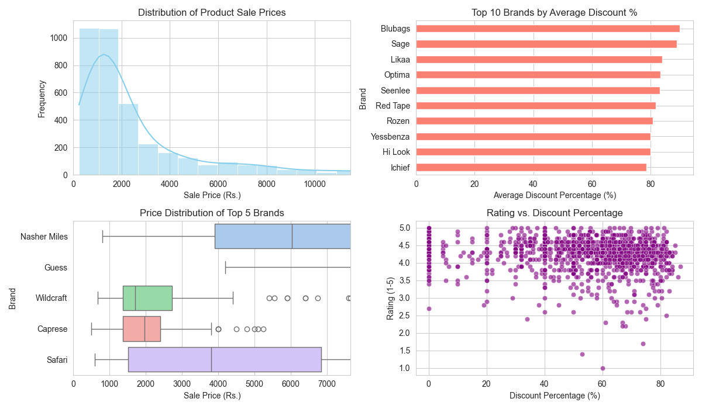

### **Project Report: E-commerce Product Pricing Analysis**

**Analysis of the Handbags and Bags Category on Myntra.com**

**Date:** August 25, 2025

---
### **1. Executive Summary**
This report details the findings from a data analysis project focused on the women's bags category on Myntra.com. By systematically scraping, cleaning, and analyzing data from over 3,700 product listings, this project aimed to uncover key insights into pricing strategies, brand positioning, and consumer ratings.

The analysis reveals a diverse market with prices ranging from budget-friendly to premium, though the average sale price of a bag is approximately ₹3,155. A significant observation is the low mean rating of 1.38 across all products, heavily influenced by a large number of unrated items. The market shows clear dominance by brands like **Caprese** and **Nasher Miles** in terms of product variety. Furthermore, the analysis identifies niche brands, such as **Blubags**, that compete aggressively on price by offering the highest average discounts. Sub-category analysis indicates that "Unisex" and "Women" are the most common product descriptors, with items explicitly labeled for "Men" commanding the highest average price.

---
### **2. Data Collection Process**

The data was gathered from the "Women's Handbags and Bags" category on Myntra's official website. Given the site's dynamic, JavaScript-driven nature, **Python** with the **Selenium** library was employed to automate a web browser, ensuring all product data could be accessed.

The core of the scraper was a pagination loop. It was engineered to:
1.  Load the initial category page.
2.  Scrape all product details present on the page.
3.  Locate the "Next" button, scroll it into view, and programmatically click it to advance to the subsequent page.
4.  Repeat this cycle until the last page was reached, at which point the process would terminate gracefully.

The following data points were collected for each of the 3,790 products: **Product Name, Brand, MRP, Sale Price, Rating, and Product URL**. The process was designed to be respectful of Myntra's servers, adhering to the guidelines in its `robots.txt` file and using appropriate delays between requests.

---
### **3. Key Findings from the Analysis**

The analysis of the cleaned dataset yielded several actionable insights.

#### **Price and Rating Overview**
The product catalog is extensive, with prices catering to a wide range of consumers.
* **Average Price:** The mean sale price is **₹3,155**, with 50% of all bags priced under ₹1,610. Prices range from a minimum of ₹231 to a maximum of ₹41,200.
* **Rating Distribution:** The most striking finding is the low **mean rating of 1.38 out of 5**. The median rating is 0.0, which indicates that more than half of the products in the dataset have no user ratings at all. This suggests that a vast portion of the catalog has low engagement or consists of newly listed items.

#### **Brand Dominance**
A few brands have a significantly larger presence in the women's bags category, giving them greater visibility.
* **Top Brands by Volume:** The top 5 brands by the number of products listed are:
    1.  **Caprese** (137 products)
    2.  **Nasher Miles** (107 products)
    3.  **Guess** (97 products)
    4.  **Wildcraft** (92 products)
    5.  **Safari** (70 products)

#### **Discount Strategy Analysis**
The data shows that deep discounting is a key strategy for certain brands, likely to attract price-sensitive customers.
* **Top Discounter Brands:** The brands offering the highest average discounts are not the ones with the most products. The top 5 are:
    1.  **Blubags** (90.02% avg. discount)
    2.  **Sage** (89.00% avg. discount)
    3.  **Likaa** (84.02% avg. discount)
    4.  **Optima** (83.36% avg. discount)
    5.  **Seenlee** (83.25% avg. discount)

#### **Sub-Category Insights**
Analyzing the first word in product names revealed the most common product types and their performance.
* **Most Common Categories:** "Unisex" and "Women" are the most frequent descriptors, with 533 and 493 products, respectively.
* **Price and Rating Trends:** Bags specifically labeled for **"Men"** have the highest average sale price at **₹3,022**, yet they also have the lowest average rating (0.79). **"Unisex"** bags, the largest sub-category, have a higher average rating (1.81) than most other top categories. The low ratings across all top sub-categories are consistent with the overall dataset's low mean rating.

---
### Visualizations

Here is a dashboard summarizing the key findings from the analysis:

This visual dashboard illustrates four key findings: the distribution of product sale prices, a ranking of top brands by average discount, the price spread for the most prominent brands, and the correlation between product ratings and discount percentages.

---

### **4. Challenges Faced and Solutions**

The project required overcoming several technical hurdles to ensure successful data collection and analysis.

1.  **Challenge: Dynamic Content (Pagination)**
    * **Problem:** The initial script was unable to collect more than 50 products because it was designed for infinite scroll, but the website used a pagination system.
    * **Solution:** The scraper was re-engineered to find and programmatically click the "Next" button, allowing it to iterate through all available pages.

2.  **Challenge: Locating the Clickable "Next" Button**
    * **Problem:** The script consistently failed to find the "Next" button, which was being obscured by cookie banners or was not yet interactive when the script looked for it.
    * **Solution:** This was solved by implementing a robust, multi-step process: running the browser in a visible (headed) mode for debugging, using a targeted JavaScript command (`scrollIntoView`) to ensure the button was visible on screen, and using `WebDriverWait` to pause the script until the button was verifiably clickable.

3.  **Challenge: Incorrect HTML Selector**
    * **Problem:** The final blocker was that the script was looking for an incorrect HTML element (`<a>` tag) for the "Next" button.
    * **Solution:** By inspecting the page's HTML, we identified that the clickable element was actually a list item (`<li>` tag). Correcting the CSS selector in the script to `li.pagination-next` immediately resolved the issue.

4.  **Challenge: Data Integrity Issues**
    * **Problem:** The analysis script initially crashed with an `AttributeError` when trying to process the `ProductName` column.
    * **Solution:** The root cause was missing product names being represented as `NaN` (a float type). The code was made more resilient by adding a check to ensure it only performed text operations on string values, safely handling any missing data.
